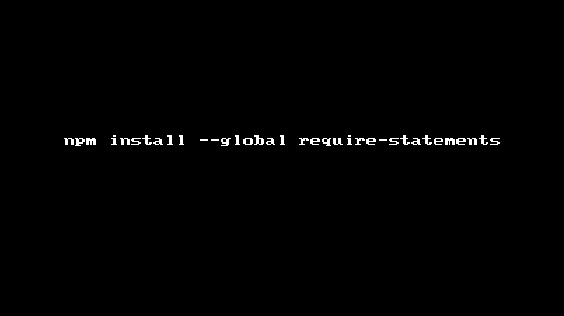

# require-statements [](https://travis-ci.org/hemanth/require-statements)

> Generators require statements from `package.json`.



## Install

```
$ npm install --save require-statements
```


## Usage

```js
var requireStatements = require('require-statements');

requireStatements(); 
// ^ Would read `./package.json` and return require statements for dependencies.

console.log(requireStatements('./package.json'));
/*
var camelcase = require(camelcase);
var meow = require(meow);
*/
```


## API

### requireStatements([path])

#### path

Type: `string`

Path to the `package.json` defaults to `./package.json`

## License

MIT © [Hemanth.HM](http://h3manth.com)
